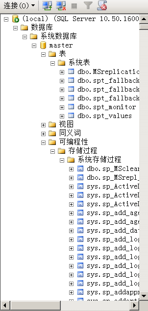

# 0x00 简介

Microsoft SQL Sever 分为很多个版本,版本的不断的升级安全性也越来越高,对我们渗透过程中最喜欢的版本应该就是2008以前，在2008及其以后的版本数据库的权限已经不再是system,为了迎合新的版本我接下来的实验都在2008版本下面进行，同时也介绍以前可以利用的方法，相对于MySQL这个mssql显得重了许多，他众多的功能也给我们注入过程带来了便利，所以一般数据库为mssql支持多语句我们就考虑是不是应该直接拿下webshell。


# 0x01 默认库的介绍

```
master   //用于记录所有SQL Server系统级别的信息，这些信息用于控制用户数据库和数据操作。

model    //SQL Server为用户数据库提供的样板，新的用户数据库都以model数据库为基础

msdb     //由 Enterprise Manager和Agent使用，记录着任务计划信息、事件处理信息、数据备份及恢复信息、警告及异常信息。

tempdb   //它为临时表和其他临时工作提供了一个存储区。

```


这里我们经常要打交道的库也就是master，他储存了我们的所有数据库名等等，还有很多储存过程，所谓储存过程你可以把他理解成一个函数调用的过程。

>储存过程是一个可编程的函数，它在数据库中创建并保存。它可以有SQL语句和一些特殊的控制结构组成。当希望在不同的应用程序或平台上执行相同的函数，或者封装特定功能时，存储过程是非常有用的。数据库中的存储过程可以看做是对编程中面向对象方法的模拟。它允许控制数据的访问方式。




我们以master库为例可以看到上面几个东西,其中视图表master.dbo.sysdatabases储存所有数据库名,其他数据库的视图则储存他本库的表名与列名。
每一个库的试图表都有syscolumns存储着所有的字段，可编程性储存着我们的函数。

```
select name from master.dbo.sysdatabases;


master
tempdb
model
msdb
test
asp_net
asp_test

```


mssql的储存过程是我们利用的重点，他天然支持多语句，也为我们注入提供了便利，我们可以通过查看可编程性里面的函数来查找他的功能，发现一些新的东西


# 0x02 字段的介绍

```
select top 1 name,xtype from sysobjects;

name    xtype
sysrscols   S 

```

xtype可以是下列对象类型中的一种： 
C = CHECK 约束　　D = 默认值或 DEFAULT 约束　　F = FOREIGN KEY 约束　　L = 日志　　FN = 标量函数 
IF = 内嵌表函数 　　P = 存储过程 　　PK = PRIMARY KEY 约束（类型是 K） 　　RF = 复制筛选存储过程 
 S = 系统表 　　TF = 表函数 　　TR = 触发器 　　U = 用户表 　　UQ = UNIQUE 约束（类型是 K） 
V = 视图 　　X = 扩展存储过程


# 0x03 创建数据库

```
use asp_net;

create table admin  
(  
id int primary key , 
username varchar(50) null, 
password varchar(50) null

);

insert into admin(id,username,password) values(1,'admin','admin');

```

其查询方式与mysql的语法大同小异。


# 0x04 文末

#### 本文如有错误，请及时提醒，避免误导他人

BY 404